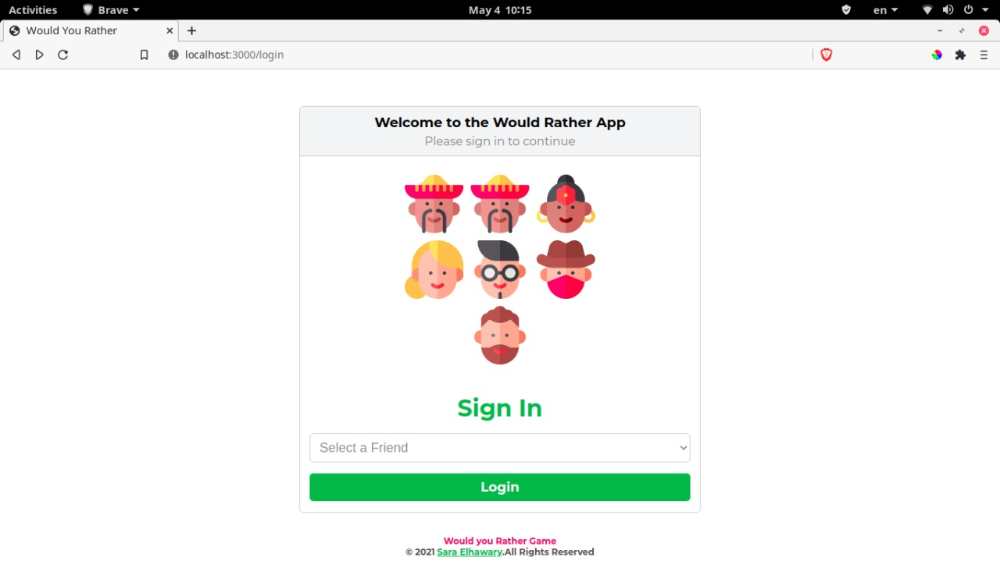

# Would You Rather

Would You Rather is a fully responsive polling game that presents the user with a series of questions.



It's built with React, React-Redux, React Router, & ReduxJS/ToolKit.

This app is the last of three projects required for FWD Egypt Initiative

## Table of contents

- [Installation](#installation)
- [Technologies](#technologies)
- [Credits](#credits)

## Installation

Clone the repository, change directories, and use NPM to install the dependencies.

```bash
$ git clone https://github.com/sara-elhawary/would-you-rather-app.git
$ cd would-you-rather-app
$ npm i
```

## Usage

The project can be run with

- `npm start`

The project can be viewed in the browser at

- [http://localhost:3000](http://localhost:3000)

## Screenshots


